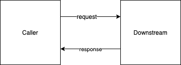

# Improving Time to Market for Software Projects #

The holy grail of software product development is time to market.

Ideally, we should be able to:

* snap software components together to create products
* design software products and communicate the design to developers
* have as few dependencies as possible
* incorporate software assets developed by third parties (and/or in-house developers)
* integrate early
* perform inspection and testing of software assets developed by third parties[^fn1]
* change the design[^fn2] when requirements change, at any point in the development process
* keep Design separated from Code.

# Film Production as a Model for Software Development #

Ideally, Software should be produced in the same manner as films are produced.[^fn3]

* Storyboard for overall film flow
* A script
* Characters, personalities, what happens if there are too many characters?  (Combine multiple characters into one).
* Scenes - detailed storyboards for every component of the film.
* rule of 7 plus minus 2 - keep things simple enough to understand / remember
* Visual assets - scenery and green-screen visual shots (who decides which assets are acceptable / unacceptable?)
* Audio assets - music (who decides what music is used, who decides what kind of music is needed for each scene?)
* Scoring
* Cut / splice points
* Time sequencing
* Final editing - what to leave on the cutting room floor?

## Why Not? ##

* Software programs have too many dependencies[^fn4]
* Software languages don't allow easy shuffling of components
* Time / sequencing is not explicitly handled, even though most business need to sequence interactions with their customers.
* Software programs do not "snap together"[^fn5] 
* Software programs cannot be understood by anyone outside of the programming community.
* Testability - programs are hard to test, even with TDD
* Programs are usually not designed in a hierarchical manner[^fn6]
* No language for Design (no blueprints)
* Hidden synchronizations cause problems (CALL / RETURN is a synchronization mechanism)
* 

# Arrowgrams is a Corporate Org Chart for Software #

# Design and Communicate #

## Decomposing Software Projects ##

### Divide and Conquer ###

#### Top Down ####

#### Bottom Up ####

# Snapping Software Components Together #

 

## Reduce Dependencies Between Components ##

## Libraries ##

## Frameworks ##

# Encapsulation #

The holy grail of software development is encapsulation.

OO (object oriented) encapsulates data and attempts to treat software as encapsulated data.

Many other aspects of a Design can be encapsulated, not just data.

Businesses already use hierarchy and encapsulation without realizing it.  For example, a department head owns five divisions where each division is headed by a manager and a group of employees.  The employees report directly to the managers, and the managers report directly to the department head.  In this way, the department head can control all of the employees without being swamped by talking to too many people.  Only the five managers report directly to the department head and they pass down directions from the department head to their employees.

This is, also, the way to design products.[^fn7]  

Divide and conquer.  

Break every part of the Design down into constituent parts so as not to be overwhelmed by all of the design decisions required in the final product.

Arrowgrams encourages such a hierarchical design process.  For example, you can Design a product in layers, examining each layer on its own.

Arrowgrams Diagrams show the layers of a product Design via composition of rectangles and show the routing of information via wires[^fn8].

The diagrammatic nature of Arrowgrams immediately shows when a particular layer is too complicated[^fn9]

## Encapsulate Everything, Not Just Data ##

## What Can Be Encapsulated ##

* control flow[^fn10]
* data
* architecture
* data transfer (message sending, parameters in calls, etc.)
* global variables
* local variables
* continuations
* callbacks
* dynamic call chains
* threading
* inter-code dependencies
* macros
* pointers
* abstraction
* polymorphism
* state
* correctness proofs
* types
* namespaces
* garbage collection, memory allocation
* concurrency
* componentization
* overloading of operators
* security
* visualization of software
* looping constructs (LOOP, recursion, etc)
* testing
* project scoping[^fn11]
* multi-cores
* distributed cpus, distributed computers
* timing, sequencing.

# Incorporate Assets Developed by Contractors #

## Incoming Inspection ##

### Is This The Same As TDD? ###

# Early Integration #

When we draw a design on a whiteboard, we are specifying how software components are expected to fit together.  Ideally, such drawings would be made rigorous and automatically converted to software.

With Arrowgrams, you can draw diagrams that compile directly to software.

The Arrowgrams Component Diagram Editor lets you draw software components as boxes[^fn12] with ports.  Boxes are connected to other boxes by drawing lines between ports.

Component boxes are loosely connected and do not create dependencies between components.[^fn13]

A Design can be created as an Arrowgrams Diagram before any code is written.  Components can be integrated before any code is written.[^fn14]

The Arrowgrams StateChart Diagram Editor[^fn15] lets you draw the internal workings of components as simple state machines.

# Refactoring Designs (Stealing Good Ideas) #

Designs can be refactored by moving boxes and wires around on an Arrowgrams Diagram, using the Arrowgrams Diagram Editor.

Good ideas can be lifted from other Designs using simple COPY/PASTE operations of the Arrowgrams Diagram Editor.

# Reusing Designs #

## Patterns ##

Reusability does not stop with Object-Oriented Software.  

Arrowgrams lets us reuse Designs.

Arrowgrams separates Design from Code.   

Arrowgrams Designs can be reused[^fn16].

# Arrowgrams is a Language for Software Design #

In designing Arrowgrams, we put emphasis on Design.  There are many languages for creating code, but precious few for expressing Software Design.

We, also, put an emphasis on compiling the designs into software.  

To make a change to an Arrowgrams Design, you use the Arrowgrams Diagram editor.  That way, designs are never out-of-date[^fn17].  There is no round-trip processing[^fn18] in Arrowgrams, because round-tripping allows software developers to change Designs simply by changing code.  There is no way to make a "last minute hack" that is not reflected in the Arrowgrams Diagrams.  Arrowgrams Diagrams never become stale and out-of-synch with the code.

# Ports vs. APIs #

Ports and wires are like a plugboard used in old-fashioned telephone exchanges, electronics and some musical synthesizers.

Ports are like mini-APIs.  The only question to be asked is "can I plug this wire into this Component?".

There are input and output ports.  

APIs tend to come in one, asymmetrical option - input apis.  And, APIs are much more complicated, with the user needing to know the type of every parameter.  

Arrowgrams breaks types into two flavors. (1) Ports, and (2) the type of the data[^fn19] that flows on the wires into and out of the ports.  It turns out that types become less important in Arrowgrams

## Only One Way to Communicate with Components ##

Arrowgrams simplifies communication between Components.

You can only SEND data from a port to another Port.

Instead of RETURNing data to the caller, you SEND the data.

In fact, you can SEND many values[^fn20] to another Component.

A Component can SEND data to many other Components, not just the caller.

## Exceptions ##

There are no Exceptions in Arrowgrams.

When an error occurs, you SEND data out a port.

You can designate as many ports as you need for error handling.

# Message Sending #

Message Sending can only be done between components that are truly distinct.[^fn21]

# Pipelines #

# Distributed Processing, Multi-Core #

The combination of features in Arrowgrams make it ideal for distributed applications[^fn22].

Arrowgrams Components cannot share memory, so message sending is simple and easy.

Message Sending remains simple in Arrowgrams.  Messages are routed from Component to Component by their enclosing Schematic.[^fn23]

Diagrams instantly show where messages and wires are tangled and have become too complicated.[^fn24]  Designers can untangle wires using the hierarchical rules[^fn25] of Arrowgrams.

The model for Arrowgrams Designs is shown in Fig. 1[^fn26]

![][degenerate]

Fig. 1

All Arrowgrams Components "run to completion" and cannot be interrupted.

## Loops, Unbounded Recursion ##

Loops are the exception, not the rule, in Arrowgrams.

Loops are frowned upon.

Infinite loops will cause system failure.[^fn27]

Recursion is allowed only inside of code Components.  Arrowgrams is a notation for designing systems using Components that are plugged together by wires.  The concept of recursion does not apply to the description of Components that are plugged together by wires.

## Event Loop Model ##

Arrowgrams Components are based on the Event Loop Model.[^fn28]

A Component spins around watching its input ports for an event.

When an event arrives, the Component reacts to it and may generate output events[^fn29].

## RPC (Remote Procedure Calls) ##

Arrowgrams does not support Remote Procedure Calls (RPC) directly.

All Arrowgrams components are concurrent and asynchronous[^fn30].

It is possible to explicitly create RPC if the design requires it.  This is done by a process called handshaking.  A Component can RPC to a downstream Component by sending it a request, then entering a state where it waits for a response from the downstream Component.  See Fig. 2.

 
Fig. 2

The advantage of breaking RPC down this way is that the tables can be turned - the Downstream component can request data from the Caller[^fn31].

## Micro-Services ##

The strategy used in Fig. 2 can be used to create a micro-service based architecture.

# Every Component Makes Sense #

Every Component in an Arrowgrams design can be fully understood on its own.

Composite[^fn32] Components can be made using other Components, in layers.  Each layer makes sense.  There is no way for a Component at a lower layer to override the operation of a Component in a layer above it[^fn33]

# The Arrowgrams Model of Distributed Components #

In Arrowgrams, we design Components as if they each have their own computer[^fn34].

This philosophy simplifies Arrowgrams Designs and mimics the real world[^fn35].

# Race Conditions #

Many of the traditional problems of multi-tasking are not present in Arrowgrams designs.

In the following, we discuss some of these problems and the Arrowgrams take on them.

## Memory Sharing ##

Arrowgrams Components do not share memory[^fn36]

## Thread Safety ##

Thread safety is no longer an issue because Arrowgrams Components do not share memory.

## Full Preemption ##

Full preemption is not supported by Arrowgrams.

Many of the problems[^fn37] commonly associated with multi-tasking simply "go away" in Arrowgrams, because full preemption is not allowed.

All Arrowgrams Components "run to completion" and cannot be interrupted.  Components cannot trip over their own feet.

## Fairness ##

[degenerate]: degenerate.png

[^fn1]: Called "incoming inspection".

[^fn2]: drastically

[^fn3]: Or, Software should be produced in the way that Audio recordings are produced.

[^fn4]: Despite the existence of libraries

[^fn5]: APIs are too complicated.  Arrowgrams simplifies the concept.

[^fn6]: Despite attacks on global variables, structured programming.

[^fn7]: Including software products

[^fn8]: Arrows between ports.

[^fn9]: Which, then, leads to a decision to break the layer down even further.

[^fn10]: if/then/else, while, call, return, etc.

[^fn11]: Is this the same as Architecture or is it something else?

[^fn12]: reactangles

[^fn13]: This is crucial for design refactoring.

[^fn14]: This is not a feature of most other software techniques, including the use of Libraries and Git.

[^fn15]: niy

[^fn16]: With simple operations like COPY & PASTE.

[^fn17]: Like comments.

[^fn18]: Converting Diagrams to code, then converting code back into diagrams.

[^fn19]: event

[^fn20]: Return values

[^fn21]: e.g. Concurrent.

[^fn22]: Internet, IoT, etc.

[^fn23]: Mother part.

[^fn24]: This is the same problem as "global variables" in software.

[^fn25]: Components are arranged in layers.

[^fn26]: The places where the wire touches the rectangles are Arrowgrams Ports.  For simplicity, we do not show whether the ports are input or output in Fig. 1, although this is always required in a true Arrowgrams Diagram.

[^fn27]: Infinite loops cause system failure in every software language.

[^fn28]: This is a variant of the Mutual Multi-Tasking model.  This model was tried in Windows 3, and discredited.  This model is not suitable for time-sharing systems (like Windows or MacOS), but is quite suitable for creating software products.

[^fn29]: None, one, or many output events, possibly on different output pins.

[^fn30]: Although, components composed of other components must wait until all inner components have subsided.

[^fn31]: In this case, the Downstream Component is a Client and the Upstream Component is a Server

[^fn32]: schematic

[^fn33]: Contrast this with OO (object oriented) technology, where inheritance allows a component to override the operations of a component in a layer above it.

[^fn34]: Cpu + RAM, etc.

[^fn35]: IoT, multi-core, internet, etc.

[^fn36]: This rule can be broken when Components share the computer.  This practice is not recommended.

[^fn37]: e.g. priority inversion